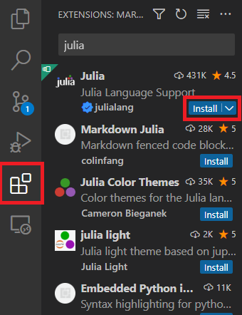
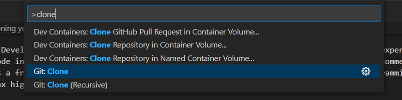

# Getting Started with Julia

A set of computational problems to help get you set up with Julia. If you haven't already installed all the software, skip down to the installation section below.

# Assignment 1

The first assignment is to help you set up Julia locally on your machine and introduce you to some of the workflow tips that are essential for having a good learning experience with the language. Follow the steps later in the guide **first** to make sure you have Julia and VS Code installed.

## Task: Collatz Problem

As a fun exercise, we will be attempting to provide a numerical implementation of checking the Collatz sequence lengths starting at some number `n`. We have provided a function definition in `src/collatz.jl` where you should fill in the function to make it return the correct answer for any input `n`.

The full problem can be seen on [Project Euler here](https://projecteuler.net/problem=14), but the general rules are:
1. Start with an input number `n`
2. Apply an update to `n`. If `n` is even then `n → n/2` otherwise `n → 3n + 1`. Using this rule starting at `13` we get `13 → 40 → 20 → 10 → 5 → 16 → 8 → 4 → 2 → 1`
3. Count the number of items in this sequence, this is the Collatz length

The first function `collatz_length` takes in one input `n` and outputs the *Collatz length* as described above.

The second function `longest_collatz_length` is very similar, and aims to find the starting integer `n` between `1` and some input `max_n` (inclusive) which has the longest Collatz length.

Make these functions only defined for integer input arguments.

The aim of this assignment is to write code which will pass **all of the** unit tests (more information about running these given below). As a summary you can run these tests easily by typing `using Pkg; Pkg.test()`.

## Running the Code

Once you have everything installed (see below for detailed instructions), you can start developing. Once you have cloned this repository and opened it in VS Code, open the REPL. This can be done via the command palette (`Ctrl+Shift+P`/`Cmd+Shift+P` or `View->Command Palette`) and type `Start REPL` and select the Julia one. From here, add a package to your default environment, by entering the package manager environment inside the REPL (press `]` and the text should turn blue):
```julia
(@v1.11) pkg> add Revise BenchmarkTools
```
Once these packages are in your global environment (for `Julia v.1.11`), they can be accessed from any environment. Activate the current environment by using the `activate` command:
```julia
(@v1.11) pkg> activate .
(Assignment1) pkg>
```
You should see the environment being used change from the global `(@v1.11)` to `(Assignment1)`. Typing `activate` in pkg mode without the `.` will send you back to the local environment.

The two packages (`Revise.jl` and `BenchmarkTools.jl`) are really the only packages that should be in a global environment.

To start developing, first load in the `Revise` package:
```julia
using Revise
```
Once loaded, load in the module `Assignment1` and use the `Revise.track` methods to auto-update when you edit the source files:
```julia
using Assignment1
Revise.track(Assignment1)
```
Now you should have access to the `collatz_length` and `longest_collatz_length` functions (as they are exported). Try running
```julia
collatz_length(5)
```
You should see nothing. Note that it may take a few seconds to compile when you first run something. 

Now change the src file `src/collatz.jl` to change the return from nothing to `0` and save the file. Use the up arrow on the keyboard to get the recent command and re-run this to see the result change. `Revise.jl` will monitor changes to your files and recompile the functions. This process also needs to be compiled, so the first time may take a few seconds.

Now you are ready to start developing your code! Make changes to the source file and test them with the REPL. 

If you want to run the tests, go to the pkg environment (using `]`) and run the `test` command:
```julia
(Assignment1) pkg> test
```

You can also run the unit tests directly from VS Code by opening up the `test/runtests.jl` file.

## Bonus: Workflow

While the coding example problem for this week is quite simple, here are a few more exercises to help you to practice a good, efficient workflow:

### **Debugging**
Try to debug your completed function and step through the code line by line to see how execution occurs. Type `@enter collatz_length(13)` into the console and verify that the sequence matches the sequence in the description. Read the relevant parts of the [documentation](https://code.visualstudio.com/Docs/editor/debugging#_debug-actions) on how to debug in VS Code, but most of the understanding just comes with practice.

### **Reading documentation**

If you are struggling to find out what a function does, no need to go to the documentation online, you can access all documentation through the terminal. Even VS Code will give you some documentation if you hover over the functions in your code. To access the documentation in the REPL, type a `?` character to enter the help command line and simply start typing the function name. You do not need to get this correct, as if there are no matches, then the REPL will search for functions that are similar to your query. For example, if you wanted to find methods that perform a `sum`, you can type:
```julia
? su
search: sum sum! summary success subtypes supertype SubArray SubString supertypes SubstitutionString isuppercase isunordered cumsum cumsum! chopsuffix ispunct issubset isnumeric ismutable issubnormal

Couldn't find su
Perhaps you meant sum, sum!, sec, sin, csc, esc, isa, !, !=, %, &, ', *, +, -, /, //, :, <, <:, <<, <=, ==, =>, >, >:, >=, >>, GC, \, ^, cd, cp, fd, im, in, mv, pi, rm, run, |, |>, ~, ÷, π, ℯ, ∈, ∉, ∋ or ∌  
  No documentation found.

  Binding su does not exist.
```
Once you know what the function is called, use the correct binding to find the documentation:
```julia
? sum
```
Most of the functions from `Base` (a package everyone has access to), will have great documentation with examples of usage and explanations of all the input arguments. If you are still unsure of what a function does, you can directly go to the source code and try to understand it from there! As the vast majority of Julia is written in Julia, you can investigate the source code easily. However, functions can have multiple implementations, depending on the input arguments, so you can use the `@which` macro to tell you which function is used to execute a line of code. For example, with `sum`, we can see what code is used to sum an array of integers:
```julia
julia> @which sum([1,2,3])
sum(a::AbstractArray; dims, kw...) in Base at reducedim.jl:994
```
Which tells you the exact file and line of code which is called. This can be very helpful when trying to track down the source code for a certain implementation.

### **Package + Script Development Workflow**

Often times, we want to separate the code that does the main bulk of our processes away from just the scripts which handle calling these functions. This allows us to organise our functions neatly **and**, more importantly, reuse these functions in other projects if we want, without just copying and pasting the functionality.

Create a `scripts` folder in the root of this directory and add this folder to your VS Code workspace (`File -> Add Folder to Workspace...`). Create a new terminal `Terminal -> New Terminal` and select the `scripts` folder in the popup. In the terminal, launch `julia` by simply typing it into the command line. Once open, activate the `scripts` environment by going into the package manager console using `]` and typing `activate .`. From here, we want access to the source code that we've already written in the `Assignment1` module. Since we expect to edit the source code and want access to the current version, we should `dev` the package instead of `add` the package. In the package manager console from the scripts terminal type
```julia
] dev ..
```
The `..` here is a relative path, a single dot represents the current folder (`scripts`) and two dots represents the parent folder (the root directory, and where the `Assignment1` `Project.toml` file is located). You could add an absolute path here, but it is not necessary. You can `add` or `dev` any package using a GitHub URL, it doesn't even need to be in the main package repository.

Now if you go back to the normal Julia terminal, you should be able to type `using Assignment1` and get access to the `collatz_length` and `longest_collatz_length` functions. The reason these are imported into global scope is due to the `export` statement in `src/Assignment1.jl`. An `export` says which functions/other bindings should be brought into global scope when someone uses a `using` statement. You can use `import` to avoid bringing the functions into global scope, but still use the functions by fully qualifying them (e.g. `Assignment1.collatz_length(13)`).

Create a script called `main.jl` in the `scripts` folder and open this in VS Code. Change your environment to the `scripts` one and re-open your REPL. Add `using Assignment1` to the source code and press `Ctrl+Enter` to send this to the REPL to confirm everything works. 

Next, let's add two packages, one to be able to reload our code in the module `Assignment1`, which is called `Revise.jl` (ignore if already added earlier). This lets you redefine your source code without having to restart the REPL. `Plots.jl` is a great plotting library that unifies many other plotting libraries with the same syntax. It allows you to easily switch between backends (e.g. `gc`, `matplotlib` etc).

```julia
] add Revise Plots
```
You may want to revise the package:
```julia
using Revise
using Assignment1
Revise.track(Assignment1)
```

Add the following code to your `main.jl` file:
```julia
using Assignment1
using Plots

function time_fn(n)
    return @elapsed longest_collatz_length(n)
end

N = 1000;
ns = ones(Int, N).*1000;
times = time_fn.(ns);

plt = histogram(times, nbins=100, xaxis=:log10, yaxis=(:log10, (0.1, N)), legend=nothing)
xlabel!(plt, "Execution Time (s)");
ylabel!(plt, "Frequency");
display(plt)
```

Notice the `;` at the end. This only suppresses output in the REPL for globally executed statements. They are not important for execution, but clear up the REPL when executing blocks. It should be noted that running things at global scope can have very poor performance. Try to put most of your code in a function and call that.

Run the code in `main.jl` in the current REPL (play button in top-right corner). Plotting the graph for the first time might take a while, but once the first plot is done, replotting takes only milliseconds. Using REPL execution like can be very beneficial as you can store the data that was expensive to generate (benchmarks), and just tweak the plotting method to look the way you want, without having to rerun the entire program again.

Look at the histogram produces. You can see that one run took around an order of magnitude longer to run than the rest. This one was likely including the compilation time of the function, we want to make sure that when we are benchmarking, we benchmark the function execution itself, not the compilation time. You can see that most execution times are clustered towards the left, with a few outliers. We usually take the min, or the median to remove outliers. We will learn more about benchmarking in the coming weeks.

# Software Installation

## Installing Julia

To install Julia, I would recommend using [`juliaup`](https://github.com/JuliaLang/juliaup), which is a tool to let you download the latest version of Julia and easily update it when new versions are released. It is highly recommended staying up to date and using the latest Julia version as there are significant performance improvements and bug fixes released regularly.

If `juliaup` has issues, the next best way to install Julia is through the binary available directly from [`julialang.org`](https://julialang.org/downloads/).

## Installing Git

Install Git on your machine by following the instructions [here](https://git-scm.com/book/en/v2/Getting-Started-Installing-Git).

This course does not expect you to learn the command line way to interact with Git, and it is actually recommended that you **do not** use the command line tools at all when starting. Instead, you should use a user-friendly GUI to interact with Git and focus on learning the workflow over the commands. Visual Studio Code (installed in the next section) has built-in Git support, but the extension `Git History` by Don Jayamanne is also recommended. However, the easiest way to use Git (and GitHub) is being using GitHub Desktop, which can be installed [here](https://desktop.github.com/). GitKraken is also recommended for Linux users.

## Setting up your IDE

An Integrated Development Environment (IDE) is essential to a productive and smooth programming experience. While it is technically possible to edit all of your source code in a standard text editor, an IDE will almost always be a better choice. The recommended editor to use for Julia is Visual Studio Code (VS Code) which is a free, (mostly) open-source and lightweight IDE which supports almost every programming language through the use of extensions. Extensions give you syntax highlighting, linting and intellisense (predictive text).

Install VS Code by following the instructions [from their website](https://code.visualstudio.com/).

Next, install the Julia extension by opening the extensions menu (`View->Extensions` or click the icon with 4 blocks on the left hand side) and searching for Julia and installing the one marked with a blue tick, as seen below:


# Cloning your repository

In order to do this week's assignment, you need to clone this repository, so you can edit the source code locally. If you are in VS Code, when you open up the program, open the Command Palette to search for a command using `Ctrl+Shift+P` (on Mac use `Cmd+Shift+P` or `View->Command Palette`) and search for `clone`, as shown in the screenshot below:


This can also be done in GitHub desktop as well. If done here, open the folder in VS Code by going to `Repository->Open in Visual Studio Code`.

# Running your source code

Julia uses a REPL (Read-Evaluate-Print-Loop) workflow, similar to that of Jupyter notebooks. It is **highly** recommended that you use this workflow, instead of running the script in the command line, like:
```sh
julia my_script.jl
```
This is because Julia is Just-In-Time (JIT) compiled, which means the first time executing some code can be quite slow, but subsequent runs are extremely fast. For this reason, it is recommended to keep open a REPL to only pay the cost of compilation once at the start of your session. 

**Note**: Some heavier packages like `Plots.jl`, `Makie.jl` or `CUDA.jl` have very large TTFX (Time To First X) latencies, which can slow down your progress if you keep closing and re-opening your REPL. If you find yourself restarting the REPL a lot, consider adjusting your workflow to use a [sysimage](https://www.julia-vscode.org/docs/stable/userguide/compilesysimage/). A sysimage precompiles some chosen packages to make them much faster to load, but this should be needed less and less when moving to Julia `v.1.9.0`.

## Starting the REPL

To start the REPL, open the command palette and type `start REPL` and select the Julia option. You should see Julia open at the bottom on your screen, with the logo and a command line, for which you can type commands:
```julia
julia> 2+2
4
```
You can write a line and press enter to execute the code. You can press `Ctrl+L` to clear the screen to stay tidy.

## Installing packages

To install a package in Julia, go to the REPL and press the `]` character, which will switch to the package manager command line interface. In brackets, it will show your currently activate *environment*. Environments are extremely important to keep track of, especially in science, to make sure your code is reproducible. Make sure you activate the environment in the repository folder root, by typing `activate .`. On my Windows machine, I get:
```julia
(@v1.11) pkg> activate .
  Activating new project at `D:\Development\MPAGS\getting-started-with-julia`

(Assignment1) pkg> 
```
This will make sure that when we add packages, a text file `Project.toml` will track any packages we add so that people in the future can have the same set of packages installed. This makes reproducibility very easy. The `Project.toml` file is lightweight and should be committed to your Git repository. Always make sure you are using an environment when developing. You can also select the environment in VS Code by opening the command palette again and typing `julia environment` and selecting one of the options.

Once you have activated the environment, you should install the packages already listed:
```julia
(Assignment1) pkg> resolve
```
and
```julia
(Assignment1) pkg> instantiate
```
This will handle installing all of the packages on your system using the listing in `Project.toml`. You will notice that you will also create a `Manifest.toml` file automatically which keeps track of the exact versions of the packages you are using. This file should **not** be committed to your Git repository in general.

You can add packages with:
```julia
(Assignment1) pkg> add Revise BenchmarkTools
```

To get out of the `pkg>` command line interface, simply press backspace.

### Final Testing

Once installed and setup, you can run the provided unit tests for this problem by using the `test` command in the package manager REPL:
```julia
(Assignment1) pkg> test
```
This will run all of the unit tests for this assignment to make sure your function is doing the correct thing.

You can also use the VS Code UI to run individual tests. Opening up `src/runtests.jl` you should see a small green play button next to each test. Press this button to run the test manually.

### Debugging your code

In order to debug your function, it is best to use the `@enter` macro provided by the VS Code Julia extension. For example, to debug your function with a certain input, type the following into your normal REPL:
```julia
julia> @enter collatz_length(13)
```
Debugging will be slow to start with, but can be extremely helpful. Look at the [documentation](https://code.visualstudio.com/Docs/editor/debugging#_debug-actions) for debugging in VS Code if you are not familiar, but this will let you step through your code line by line.
